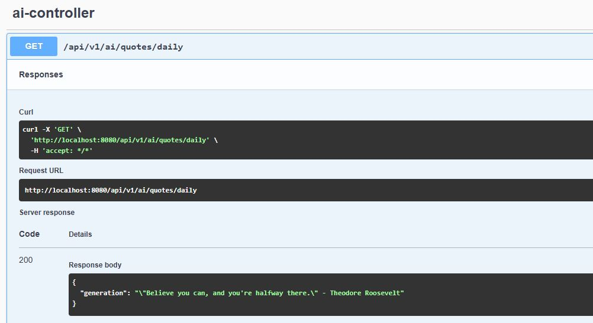
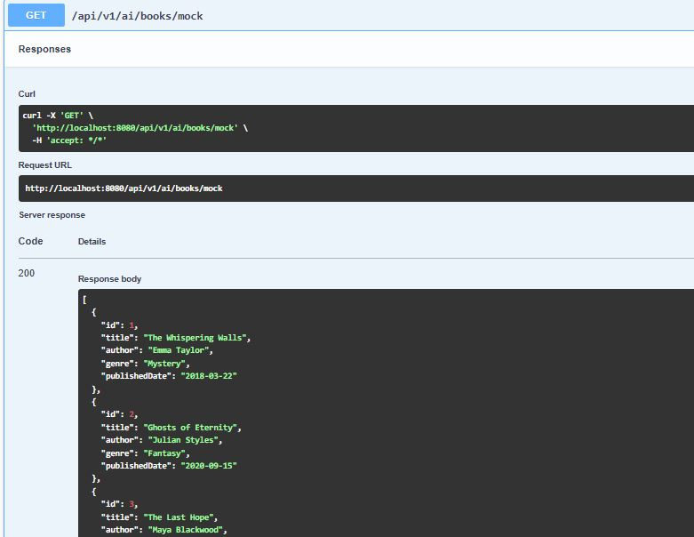
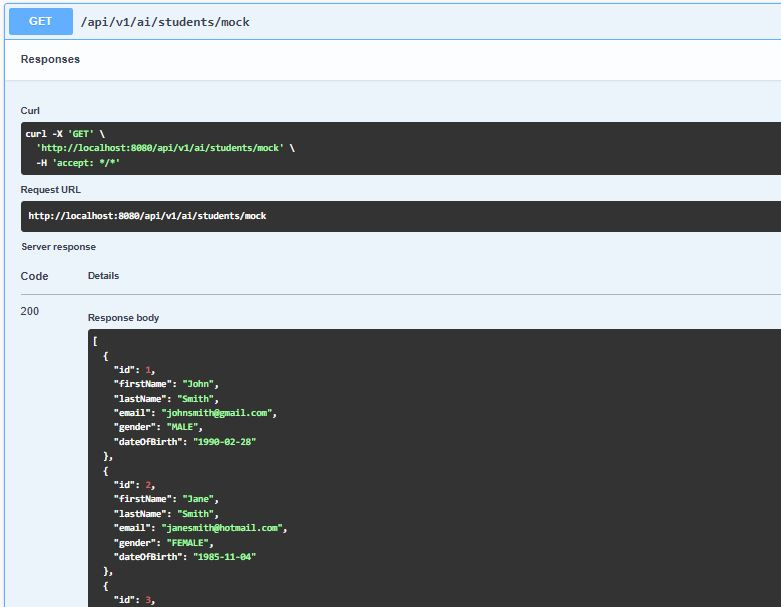

# 🧠 Spring AI Demo 
This repository contains 3 Spring Boot sub-projects showcasing how to use Spring AI with different LLM providers.

- [OpenAI](https://platform.openai.com/)
- [Ollama](https://ollama.com/) — a local LLM runtime that runs models like LLaMA3, Mistral, and more.

## 📁 Sub-Projects Overview
### 1. `spring-ai-ollama`

- Connects to a **locally running Ollama** model (like `llama3`).
- Features:
  - Chat with locally hosted ollama model using `ChatClient` .
  - Generate mock data for Book model.

### 2. `spring-ai-openai`
- Connects to **OpenAI’s API** via your `OPENAI_API_KEY`.
- Allows prompt-based chatting with OpenAI models (like `gpt-4` or `gpt-3.5-turbo`).

### 3. `spring-ai-model-switcher`

- A flexible app that:
  - **Switches** between the AI providers OpenAI, Ollama, and Mistral dynamically via Spring profiles.
  - Uses AI to **generate mock data** for a `Student` model.
- The active model is controlled by the Spring profile via:
`spring.profiles.active=ollama3, openai, or mistral.`

## ⚙️ Prerequisites

- Java 17+
- Maven
- OpenAI account (for OpenAI usage)
- [Ollama installed](https://ollama.com/download) (for local models)

## 🚀 How to Run

### 1. Clone the Repository

```bash
git clone https://github.com/Amiraelhoufy/spring-ai-demo.git
cd spring-ai-demo
```

### 2. Install Dependencies
Make sure you have Java 17+ and Maven installed.

Then run:

```bash
mvn clean install
```

### 3. 🔐 Configure Your OpenAI API Key
Before running with OpenAI, set your API key as an environment variable:

Linux/macOS:

```bash
export OPENAI_API_KEY=your_api_key_here
```
Windows CMD:
```cmd
set OPENAI_API_KEY=your_api_key_here
```
Ensure the following is in application-openai.properties:
```properties
spring.ai.openai.api-key=${OPENAI_API_KEY}
```

### 4. 🖥️ How to Install and Run Ollama Locally

1. Install from https://ollama.com/download
2. Run a model like:
```bash
ollama run llama3
```
3. Access available at http://localhost:11434


### 5. 🧪 Run the App
#### ▶️ Run spring-ai-ollama:
```bash
cd spring-ai-ollama
mvn spring-boot:run
```

#### ▶️ Run spring-ai-openai:
```bash
cd spring-ai-openai
mvn spring-boot:run -Dspring-boot.run.profiles=openai
```
#### ▶️ Run spring-ai-model-switcher with profiles:

- Ollama model: 
```bash
cd spring-ai-model-switcher
mvn spring-boot:run -Dspring-boot.run.profiles=ollama3
```

- OpenAI model:
```bash
mvn spring-boot:run -Dspring-boot.run.profiles=openai
```

### 📦 Technologies Used
- **Java 17+**
- **Spring Boot 3**
- **Spring AI 1.0.0-M5**
- **Spring Web / RestController**
- **Spring Profiles** (for model switching)
- **Jackson** (for JSON handling)
- **Maven**
- **[Swagger UI](https://swagger.io/tools/swagger-ui/)** (for REST API documentation and testing)

### ❓ Difference between ChatClient and OllamaChatModel:
| Concept            | `ChatClient`                                             | `OllamaChatModel`                          |
| ------------------ | -------------------------------------------------------- | ------------------------------------------ |
| **What it is**     | High-level client abstraction (generic)                  | Model-specific implementation              |
| **Scope**          | Can work with **any** `ChatModel` (OpenAI, Ollama, etc.) | Specific to **Ollama** only                |
| **Flexibility**    | Great for switching between models                       | Great if you want full control over Ollama |
| **Autowireable**   | Yes, if configured via Spring Boot                       | Yes                                        |
| **Custom options** | Less detailed unless configured with builder             | Full access to Ollama options              |

#### 🚨 Important: Spring AI 1.0.0-M6 Changes: In 1.0.0-M6, the ChatClient is not auto-configured by default like it was in previous versions (0.8.x) You must define it manually.


### 📄 Example Output



